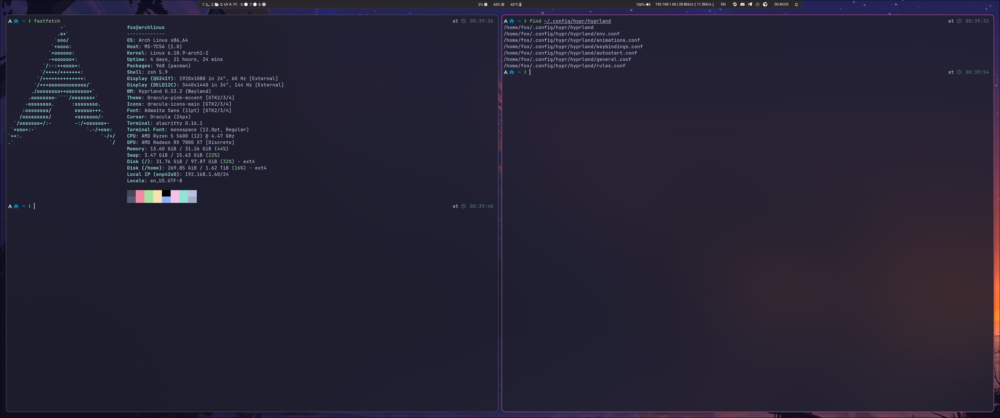
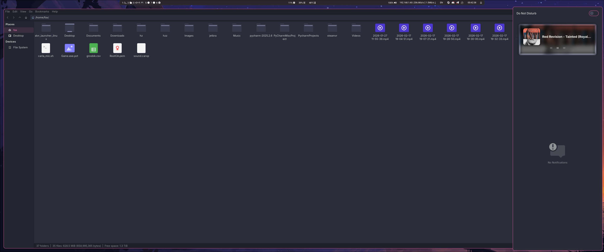
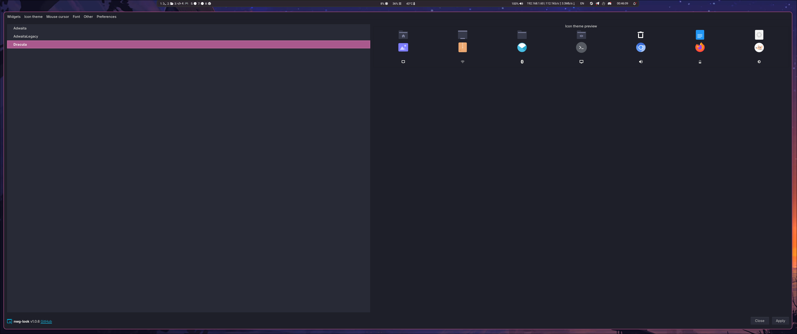

# Hyprland Dotfiles

Desktop environment configuration based on Hyprland compositor for Arch Linux.

## Table of Contents

- [Screenshots](#screenshots)
- [Features](#features)
- [Prerequisites](#prerequisites)
- [Installation](#installation)
- [Configuration](#configuration)
- [Keybindings](#keybindings)
- [Customization](#customization)
- [Troubleshooting](#troubleshooting)
- [Contributing](#contributing)

## Screenshots







## Features

- **Hyprland Compositor** - Wayland compositor
- **Custom Keybindings** - Configured shortcuts for window management and application launching
- **Dracula Theme** - Dark theme for GTK applications
- **Animations** - Configured animations and transitions
- **Automated Installation** - Installation script
- **Python-based Builder** - Configuration builder with Poetry dependency management

## Prerequisites

- Arch Linux (minimal installation recommended)
- Git
- Python 3
- Poetry (Python dependency management)

## Installation

1. **Prepare the system**
   ```bash
   # Enable multilib repository
   sudo nano /etc/pacman.conf
   # Uncomment [multilib] section
   
   # Enable your locale
   sudo nano /etc/locale.gen
   # Uncomment your locale (e.g., en_US.UTF-8)
   
   sudo locale-gen
   ```

2. **Install dependencies**
   ```bash
   sudo pacman -S git python3 poetry
   ```

3. **Clone and install**
   ```bash
   git clone https://github.com/Fox-sys/Hyprland-dotfiles.git
   cd Hyprland-dotfiles
   ./install.sh
   ```

4. **Launch Hyprland**
   ```bash
   Hyprland
   ```

## Configuration

The configuration is organized into modular files:

- `config/hypr/hyprland/general.conf` - General Hyprland settings
- `config/hypr/hyprland/animations.conf` - Animation configurations
- `config/hypr/hyprland/keybindings.conf` - Keyboard shortcuts
- `config/hypr/hyprland/rules.conf` - Window rules
- `config/hypr/hyprpaper.conf` - Wallpaper configuration

## Keybindings

Key bindings are configured in `config/hypr/hyprland/keybindings.conf`.

Most needed shortcuts:

- **Alacritty**: SUPER + Enter
- **Thunar**: SUPER + 2
- **Firefox**: SUPER + 1
- **Floating window mode**: SUPER + Space

## Customization

### Themes

The repository includes the Dracula theme located in `themes/Dracula/`.
Theme files support:

- GTK 2.0, 3.0, 3.20, 4.0
- Metacity
- XFWM4
- Unity

## Troubleshooting

### Display issues

Ensure your graphics drivers are properly installed. The builder system includes
a driver installer service.

### Configuration not loading

Check file permissions and ensure all config files are in the correct locations.

## License

This project is open source. Feel free to use and modify as needed.

---

**Note:** This configuration is personalized and may require adjustments for your specific hardware and preferences.
